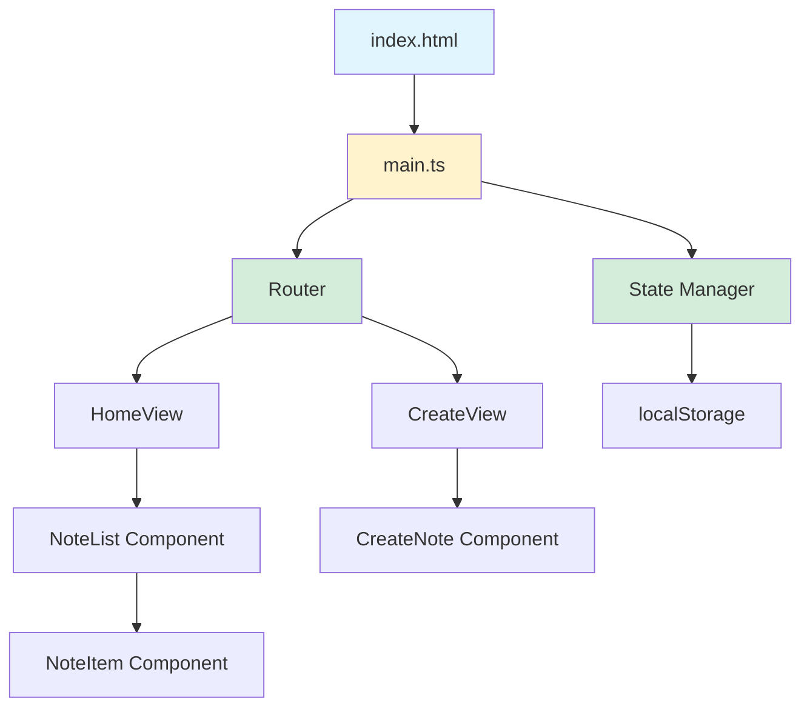
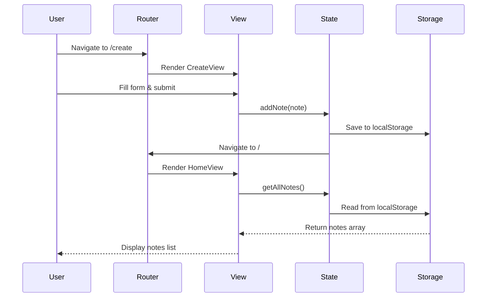
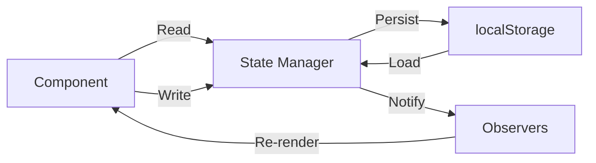
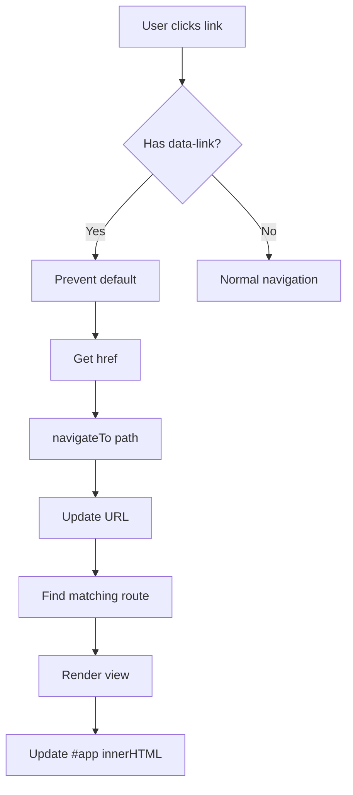

# Notes App - Complete Developer & Manager Documentation

## 📖 Table of Contents

1. [Executive Summary](#executive-summary)
2. [Project Overview](#project-overview)
3. [Architecture & Design](#architecture--design)
4. [Technical Stack](#technical-stack)
5. [Development Guide](#development-guide)
6. [Component Reference](#component-reference)
7. [State Management](#state-management)
8. [Routing System](#routing-system)
9. [Data Persistence](#data-persistence)
10. [Testing Strategy](#testing-strategy)
11. [Deployment Guide](#deployment-guide)
12. [Team Workflow](#team-workflow)
13. [Performance Considerations](#performance-considerations)
14. [Security Guidelines](#security-guidelines)
15. [Troubleshooting](#troubleshooting)
16. [Future Roadmap](#future-roadmap)

---

## Executive Summary

### For Managers

**What is this project?**
A lightweight web application that allows users to create and manage personal notes directly in their web browser. Think of it as a simplified, browser-based note-taking tool similar to Apple Notes or Google Keep, but running entirely on the user's device.

**Key Business Value:**
- **Zero Infrastructure Costs**: Runs entirely in the browser, no backend servers needed
- **Fast Development**: Built with modern, efficient tools (Vite + TypeScript)
- **Privacy-First**: All data stays on the user's device
- **Easy Deployment**: Can be hosted on free static hosting platforms

**Timeline Estimates:**
- Initial Development: 2-3 days
- Testing & QA: 1 day
- Deployment: 0.5 days
- **Total: ~1 week** for a production-ready application

**Resource Requirements:**
- 1 Frontend Developer
- Optional: 1 QA Engineer for testing
- No backend/infrastructure team needed

**Technical Risk Level:** Low
- Well-established technologies
- No complex backend integration
- Clear, well-defined scope

---

### For Developers

**Quick Start Checklist:**
```bash
✓ Node.js v16+ installed
✓ Clone repository
✓ Run: npm install
✓ Run: npm run dev
✓ Open: http://localhost:5173
```

**Tech Stack at a Glance:**
- **Language**: TypeScript (strict mode)
- **Build Tool**: Vite 7.x
- **Framework**: Vanilla (no React/Vue/Angular)
- **Styling**: Vanilla CSS
- **Storage**: Browser localStorage
- **Routing**: HTML5 History API

**Key Design Patterns:**
- Component-based architecture
- Props and state management (vanilla implementation)
- Observer pattern for state updates
- Single Responsibility Principle for components

---

## Project Overview

### Goals & Objectives

1. **Primary Goal**: Create a functional note-taking SPA that demonstrates modern web development practices
2. **Learning Objectives**: 
   - Understand component-based architecture without frameworks
   - Master client-side routing
   - Implement state management patterns
   - Work with browser APIs (localStorage, History)

### Scope

**In Scope:**
- Create, view, and list notes
- Client-side routing between views
- Persistent storage using localStorage
- Responsive design for mobile and desktop
- TypeScript for type safety

**Out of Scope (Future Enhancements):**
- User authentication
- Backend/database integration
- Real-time collaboration
- Rich text editing
- File attachments
- Cloud synchronization

### Success Criteria

- [ ] Users can create notes with title and content
- [ ] Notes persist across browser sessions
- [ ] Navigation works without page reloads
- [ ] Application is responsive on mobile devices
- [ ] TypeScript compiles without errors
- [ ] Production build size < 100KB (gzipped)
- [ ] Lighthouse score > 90/100

---

## Architecture & Design

### High-Level Architecture



### Application Flow



### Directory Structure Philosophy

```
src/
├── main.ts              # App initialization
├── router.ts            # Routing logic (navigation)
├── state.ts             # State management (data layer)
├── types.ts             # TypeScript interfaces
├── components/          # Reusable UI components
│   ├── NoteItem.ts      # Single note display
│   ├── NoteList.ts      # Collection of notes
│   ├── CreateNote.ts    # Note creation form
│   └── Header.ts        # Navigation header
└── views/               # Full page views
    ├── HomeView.ts      # List view
    └── CreateView.ts    # Create view
```

**Separation of Concerns:**
- **Components**: Reusable UI pieces (can be used in multiple views)
- **Views**: Full page layouts (composed of components)
- **Router**: Navigation logic only
- **State**: Data management only

---

## Technical Stack

### Core Technologies

| Technology | Version | Purpose | Why Chosen |
|------------|---------|---------|------------|
| **TypeScript** | ~5.9.3 | Type-safe JavaScript | Catch errors at compile time, better IDE support |
| **Vite** | ^7.2.4 | Build tool | Lightning-fast HMR, modern dev experience |
| **HTML5** | - | Markup | Semantic elements, modern APIs |
| **CSS3** | - | Styling | Custom properties, Grid, Flexbox |
| **localStorage API** | - | Data persistence | Simple, no backend needed |
| **History API** | - | Client-side routing | SEO-friendly URLs, no hash routing |

### TypeScript Configuration

**Key Settings (`tsconfig.json`):**

```json
{
  "target": "ES2022",           // Modern JavaScript features
  "strict": true,               // Strictest type checking
  "noUnusedLocals": true,       // Catch unused variables
  "noUnusedParameters": true,   // Catch unused function params
  "moduleResolution": "bundler" // Vite's module system
}
```

**Benefits:**
- Catch common bugs before runtime
- Better autocomplete and IntelliSense
- Self-documenting code through types
- Easier refactoring

### Build Configuration

**Vite Features Used:**
- Hot Module Replacement (HMR)
- TypeScript compilation
- CSS processing
- Asset optimization
- Code splitting (optional)

**Development vs Production:**

| Feature | Development | Production |
|---------|-------------|------------|
| Compilation | Fast, no minification | Optimized, minified |
| Source Maps | Full inline | External (optional) |
| Server | Dev server with HMR | Static files in `dist/` |
| Bundle Size | Larger (for debugging) | Minimized (~30-50KB) |

---

## Development Guide

### Getting Started

#### 1. Environment Setup

**Required Software:**
```bash
# Check Node.js version (must be v16+)
node --version

# Check npm version
npm --version
```

**Installation:**
```bash
# Clone repository
git clone <repository-url>
cd Notes_app

# Install dependencies
npm install

# Verify installation
npm run dev
```

#### 2. Development Workflow

**Daily Workflow:**
```bash
# Start dev server
npm run dev

# In another terminal, run type checking (optional)
npx tsc --watch --noEmit
```

**Before Committing:**
```bash
# Check for TypeScript errors
npx tsc --noEmit

# Build to verify production bundle
npm run build

# Preview production build
npm run preview
```

### Code Style Guidelines

#### TypeScript Best Practices

**1. Always Use Explicit Types:**
```typescript
// ❌ Bad - implicit any
function createNote(title, content) {
  // ...
}

// ✅ Good - explicit types
function createNote(title: string, content: string): Note {
  // ...
}
```

**2. Use Interfaces for Data Models:**
```typescript
// Define in types.ts
export interface Note {
  id: string;
  title: string;
  content: string;
  timestamp: string;
}
```

**3. Prefer Const Over Let:**
```typescript
// ❌ Bad
let notes = getNotes();

// ✅ Good
const notes = getNotes();
```

#### Component Structure

**Standard Component Template:**
```typescript
export interface ComponentProps {
  // Define props interface
}

export function ComponentName(props: ComponentProps): string {
  // Destructure props
  const { prop1, prop2 } = props;
  
  // Component logic
  
  // Return HTML string
  return `
    <div class="component-name">
      <!-- Component markup -->
    </div>
  `;
}
```

#### CSS Organization

**BEM Methodology:**
```css
/* Block */
.note-item {
  /* styles */
}

/* Element */
.note-item__title {
  /* styles */
}

/* Modifier */
.note-item--highlighted {
  /* styles */
}
```

**CSS Variables:**
```css
:root {
  --primary-color: #007bff;
  --text-color: #333;
  --spacing-unit: 8px;
}
```

### Common Development Tasks

#### Adding a New Component

**Step-by-step:**

1. **Create component file** in `src/components/`
   ```typescript
   // src/components/MyComponent.ts
   export interface MyComponentProps {
     title: string;
   }
   
   export function MyComponent(props: MyComponentProps): string {
     return `<div>${props.title}</div>`;
   }
   ```

2. **Add styles** in `src/style.css`
   ```css
   .my-component {
     padding: 1rem;
   }
   ```

3. **Use in a view**
   ```typescript
   import { MyComponent } from './components/MyComponent';
   
   const html = MyComponent({ title: 'Hello' });
   ```

#### Adding a New Route

**Step-by-step:**

1. **Create view file** in `src/views/`
2. **Register route** in `router.ts`
   ```typescript
   const routes = {
     '/': HomeView,
     '/create': CreateView,
     '/my-route': MyNewView, // Add here
   };
   ```

3. **Add navigation link** in Header component
   ```html
   <a href="/my-route" data-link>My Route</a>
   ```

---

## Component Reference

### NoteItem Component

**Purpose:** Display a single note in the list view

**File:** `src/components/NoteItem.ts`

**Interface:**
```typescript
export interface NoteItemProps {
  note: Note;
}
```

**Usage:**
```typescript
import { NoteItem } from './components/NoteItem';

const html = NoteItem({
  note: {
    id: '123',
    title: 'My Note',
    content: 'Note content...',
    timestamp: '2026-01-15T14:30:00.000Z'
  }
});
```

**Rendered HTML:**
```html
<div class="note-item" data-note-id="123">
  <h3 class="note-item__title">My Note</h3>
  <time class="note-item__time">Jan 15, 2026</time>
  <p class="note-item__preview">Note content...</p>
</div>
```

**Event Handlers:**
- Click on note → Navigate to note detail view

---

### NoteList Component

**Purpose:** Render a list of all notes with empty state handling

**File:** `src/components/NoteList.ts`

**Interface:**
```typescript
export interface NoteListProps {
  notes: Note[];
}
```

**Usage:**
```typescript
import { NoteList } from './components/NoteList';

const notes = getAllNotes();
const html = NoteList({ notes });
```

**Empty State:**
```html
<div class="note-list--empty">
  <p>No notes yet. Create your first note!</p>
  <a href="/create" data-link>Create Note</a>
</div>
```

---

### CreateNote Component

**Purpose:** Form for creating new notes

**File:** `src/components/CreateNote.ts`

**State Management:**
```typescript
// Internal state (form values)
let title = '';
let content = '';
```

**Form Submission:**
```typescript
form.addEventListener('submit', (e) => {
  e.preventDefault();
  
  // Validation
  if (!title.trim() || !content.trim()) {
    alert('Please fill in all fields');
    return;
  }
  
  // Create note
  const note = createNote(title, content);
  
  // Navigate to home
  navigateTo('/');
});
```

---

### Header Component

**Purpose:** Navigation and branding

**File:** `src/components/Header.ts`

**Features:**
- App logo/title
- Navigation links
- Active route highlighting

**Active Link Logic:**
```typescript
const currentPath = window.location.pathname;
const activeClass = link.href === currentPath ? 'active' : '';
```

---

## State Management

### State Architecture



### State Manager API

**File:** `src/state.ts`

**Core Functions:**

```typescript
// Get all notes
export function getAllNotes(): Note[]

// Get single note by ID
export function getNoteById(id: string): Note | undefined

// Add new note
export function addNote(title: string, content: string): Note

// Update existing note
export function updateNote(id: string, updates: Partial<Note>): void

// Delete note
export function deleteNote(id: string): void

// Subscribe to changes
export function subscribe(callback: () => void): () => void
```

### Usage Examples

**Creating a Note:**
```typescript
import { addNote } from './state';

const note = addNote('My Title', 'My content here');
console.log(note.id); // "1705329000000"
```

**Reading Notes:**
```typescript
import { getAllNotes } from './state';

const notes = getAllNotes();
notes.forEach(note => {
  console.log(note.title);
});
```

**Subscribing to Changes:**
```typescript
import { subscribe } from './state';

const unsubscribe = subscribe(() => {
  console.log('State changed!');
  renderView();
});

// Later: stop listening
unsubscribe();
```

### Data Model

**Note Interface:**
```typescript
interface Note {
  id: string;              // Timestamp-based: Date.now().toString()
  title: string;           // User input
  content: string;         // User input
  timestamp: string;       // ISO 8601: new Date().toISOString()
}
```

**Example Note:**
```json
{
  "id": "1705329000000",
  "title": "Shopping List",
  "content": "- Milk\n- Bread\n- Eggs",
  "timestamp": "2026-01-15T14:30:00.000Z"
}
```

---

## Routing System

### Router Architecture

**File:** `src/router.ts`

**Core Concepts:**
1. **Route Registration**: Map paths to view components
2. **Navigation**: Update URL and render view
3. **Link Handling**: Intercept clicks on `[data-link]` elements
4. **Browser History**: Support back/forward buttons

### Router API

```typescript
// Navigate programmatically
export function navigateTo(path: string): void

// Initialize router (called once in main.ts)
export function initRouter(): void

// Register routes
const routes: Record<string, () => string> = {
  '/': HomeView,
  '/create': CreateView,
};
```

### Navigation Flow



### Usage Examples

**In HTML:**
```html
<!-- ✅ Client-side navigation -->
<a href="/create" data-link>Create Note</a>

<!-- ❌ Full page reload -->
<a href="/create">Create Note</a>
```

**In TypeScript:**
```typescript
import { navigateTo } from './router';

// After saving a note
addNote(title, content);
navigateTo('/'); // Go to home
```

**Handling Browser Back/Forward:**
```typescript
window.addEventListener('popstate', () => {
  router(); // Re-render current route
});
```

---

## Data Persistence

### localStorage Strategy

**Storage Key:**
```typescript
const STORAGE_KEY = 'notes-app-data';
```

**Data Structure:**
```json
{
  "notes": [
    {
      "id": "1705329000000",
      "title": "Note 1",
      "content": "Content...",
      "timestamp": "2026-01-15T14:30:00.000Z"
    }
  ]
}
```

### Storage Functions

**Save to localStorage:**
```typescript
function saveToStorage(notes: Note[]): void {
  const data = { notes };
  localStorage.setItem(STORAGE_KEY, JSON.stringify(data));
}
```

**Load from localStorage:**
```typescript
function loadFromStorage(): Note[] {
  const data = localStorage.getItem(STORAGE_KEY);
  if (!data) return [];
  
  try {
    const parsed = JSON.parse(data);
    return parsed.notes || [];
  } catch (error) {
    console.error('Failed to parse stored data', error);
    return [];
  }
}
```

### localStorage Limits

**Browser Quotas:**
| Browser | Limit |
|---------|-------|
| Chrome | ~10 MB |
| Firefox | ~10 MB |
| Safari | ~5 MB |
| Edge | ~10 MB |

**Estimation:**
- Average note (title + content): ~1 KB
- Theoretical capacity: ~5,000-10,000 notes
- Practical limit: ~1,000 notes (for performance)

### Error Handling

**Quota Exceeded:**
```typescript
function addNote(title: string, content: string): Note {
  try {
    // Create and save note
    saveToStorage(notes);
  } catch (error) {
    if (error.name === 'QuotaExceededError') {
      alert('Storage full! Please delete some notes.');
    }
    throw error;
  }
}
```

---

## Testing Strategy

### Manual Testing Checklist

**Feature Testing:**
- [ ] Can create a note with title and content
- [ ] Note appears in home list after creation  
- [ ] Notes persist after browser refresh
- [ ] Can navigate between / and /create
- [ ] Back/forward buttons work correctly
- [ ] Mobile responsive (test on 375px width)

**Edge Cases:**
- [ ] Creating note with empty title/content
- [ ] Creating note with very long content (>10,000 chars)
- [ ] Creating 100+ notes (performance test)
- [ ] Clearing localStorage and refreshing
- [ ] Opening app in new tab (data sharing)

**Cross-Browser Testing:**
- [ ] Chrome (latest)
- [ ] Firefox (latest)
- [ ] Safari (latest)
- [ ] Edge (latest)
- [ ] Mobile Safari (iOS)
- [ ] Mobile Chrome (Android)

### Automated Testing (Future)

**Recommended Tools:**
- **Unit Tests**: Vitest
- **E2E Tests**: Playwright or Cypress
- **Type Checking**: `tsc --noEmit`

**Example Unit Test:**
```typescript
import { describe, it, expect } from 'vitest';
import { addNote, getAllNotes } from './state';

describe('State Management', () => {
  it('should add a note', () => {
    const note = addNote('Test', 'Content');
    expect(note.title).toBe('Test');
    expect(getAllNotes()).toContain(note);
  });
});
```

---

## Deployment Guide

### Build Process

**1. Create Production Build:**
```bash
npm run build
```

**Output:**
```
dist/
├── index.html
├── assets/
│   ├── index-[hash].js
│   ├── index-[hash].css
│   └── [other assets]
```

**2. Test Production Build Locally:**
```bash
npm run preview
```

**3. Verify Build:**
- [ ] Check bundle size (should be < 100 KB gzipped)
- [ ] Test all functionality
- [ ] Check console for errors
- [ ] Run Lighthouse audit

### Hosting Options

#### Option 1: Netlify (Recommended)

**Steps:**
```bash
# Install Netlify CLI
npm install -g netlify-cli

# Deploy
netlify deploy --prod --dir=dist
```

**Netlify Configuration (`netlify.toml`):**
```toml
[build]
  publish = "dist"
  command = "npm run build"

[[redirects]]
  from = "/*"
  to = "/index.html"
  status = 200
```

#### Option 2: Vercel

```bash
# Install Vercel CLI
npm install -g vercel

# Deploy
vercel --prod
```

#### Option 3: GitHub Pages

**Steps:**
1. Build the project: `npm run build`
2. Install gh-pages: `npm install -D gh-pages`
3. Add script to `package.json`:
   ```json
   "deploy": "gh-pages -d dist"
   ```
4. Deploy: `npm run deploy`

#### Option 4: AWS S3 + CloudFront

**Steps:**
1. Create S3 bucket
2. Enable static website hosting
3. Upload `dist/` folder
4. Configure CloudFront distribution (optional)
5. Update DNS records

### Environment Configuration

**For Different Environments:**

```typescript
// src/config.ts
export const config = {
  isDevelopment: import.meta.env.DEV,
  isProduction: import.meta.env.PROD,
  storageKey: import.meta.env.VITE_STORAGE_KEY || 'notes-app-data',
};
```

**Usage:**
```typescript
import { config } from './config';

if (config.isDevelopment) {
  console.log('Debug info:', notes);
}
```

---

## Team Workflow

### Git Workflow

**Branch Strategy:**
```
main (production-ready)
  ├── develop (integration)
  │   ├── feature/add-edit-functionality
  │   ├── feature/search-notes
  │   └── bugfix/routing-issue
```

**Typical Workflow:**
```bash
# Start new feature
git checkout develop
git pull origin develop
git checkout -b feature/my-feature

# Make changes, commit
git add .
git commit -m "feat: add my feature"

# Push and create PR
git push origin feature/my-feature
# Create PR to develop branch
```

### Commit Message Convention

**Format:**
```
<type>(<scope>): <subject>

<body>

<footer>
```

**Types:**
- `feat`: New feature
- `fix`: Bug fix
- `docs`: Documentation
- `style`: Formatting, missing semicolons
- `refactor`: Code restructure
- `test`: Adding tests
- `chore`: Build process, dependencies

**Examples:**
```bash
feat(notes): add delete note functionality
fix(router): handle 404 routes correctly
docs(readme): update installation instructions
style(css): improve note card spacing
refactor(state): extract localStorage logic
```

### Code Review Checklist

**Before Requesting Review:**
- [ ] Code compiles without errors (`npm run build`)
- [ ] Manual testing completed
- [ ] No console errors or warnings
- [ ] Code follows style guidelines
- [ ] Comments added for complex logic

**Reviewer Checklist:**
- [ ] Code meets requirements
- [ ] No TypeScript errors
- [ ] Performance considerations addressed
- [ ] Edge cases handled
- [ ] Naming conventions followed
- [ ] No hardcoded values

---

## Performance Considerations

### Bundle Size Optimization

**Current Bundle Analysis:**
- Initial bundle: ~30-50 KB (gzipped)
- Dependencies: Minimal (only Vite for dev)
- Runtime: Pure vanilla TypeScript

**Code Splitting (Future):**
```typescript
// Dynamic component loading
const NoteList = () => import('./components/NoteList');
```

### Rendering Performance

**Virtual DOM Alternative:**
Since we're using vanilla JS, implement efficient re-rendering:

```typescript
// ❌ Bad: Re-render entire list
function renderNotes() {
  document.getElementById('notes').innerHTML = notes.map(NoteItem).join('');
}

// ✅ Good: Only update changed items
function renderNotes() {
  const container = document.getElementById('notes');
  notes.forEach((note, index) => {
    const existing = container.children[index];
    if (!existing || existing.dataset.noteId !== note.id) {
      // Only render if changed
      const element = createNoteElement(note);
      container.appendChild(element);
    }
  });
}
```

### localStorage Performance

**Best Practices:**
- Read from localStorage on app init only
- Keep notes in memory during session
- Write to localStorage only on changes
- Debounce frequent writes

**Optimization:**
```typescript
let saveTimeout: number;

function debouncedSave(notes: Note[]) {
  clearTimeout(saveTimeout);
  saveTimeout = setTimeout(() => {
    saveToStorage(notes);
  }, 300); // Save 300ms after last change
}
```

---

## Security Guidelines

### Data Security

**localStorage Security:**
> [!WARNING]
> localStorage is NOT encrypted. Sensitive data should not be stored here.

**Current Approach:**
- Notes contain only user-created content
- No passwords or personal identifiable information
- Data accessible only to same origin

**Future: Encryption (Optional):**
```typescript
// Encrypt before storing
function encryptNote(note: Note): string {
  return CryptoJS.AES.encrypt(JSON.stringify(note), userKey).toString();
}
```

### XSS Prevention

**Content Sanitization:**
```typescript
// ❌ Dangerous: Direct HTML injection
element.innerHTML = note.content;

// ✅ Safe: Escape HTML
function escapeHtml(unsafe: string): string {
  return unsafe
    .replace(/&/g, "&amp;")
    .replace(/</g, "&lt;")
    .replace(/>/g, "&gt;")
    .replace(/"/g, "&quot;")
    .replace(/'/g, "&#039;");
}

element.innerHTML = escapeHtml(note.content);
```

### Content Security Policy

**Recommended CSP Header:**
```html
<meta http-equiv="Content-Security-Policy" 
      content="default-src 'self'; script-src 'self'; style-src 'self' 'unsafe-inline';">
```

---

## Troubleshooting

### Common Issues

#### Issue: "Vite server won't start"

**Symptoms:**
```
Error: Port 5173 is already in use
```

**Solutions:**
```bash
# Option 1: Kill process on port 5173
lsof -ti:5173 | xargs kill -9

# Option 2: Use different port
npm run dev -- --port 3000
```

---

#### Issue: "TypeScript compilation errors"

**Symptoms:**
```
error TS2345: Argument of type 'string' is not assignable to parameter of type 'number'
```

**Solutions:**
1. Check type definitions in `src/types.ts`
2. Ensure all function parameters have correct types
3. Run `npx tsc --noEmit` to see all errors

---

#### Issue: "Notes not persisting"

**Symptoms:**
- Notes disappear after refresh

**Debug Steps:**
```typescript
// Check localStorage
console.log(localStorage.getItem('notes-app-data'));

// Verify save function is called
function saveToStorage(notes: Note[]) {
  console.log('Saving notes:', notes);
  localStorage.setItem('notes-app-data', JSON.stringify({ notes }));
}
```

**Common Causes:**
- localStorage disabled (private browsing)
- Safari cross-origin restrictions
- Storage quota exceeded

---

#### Issue: "Routing not working after deployment"

**Symptoms:**
- Direct URL access returns 404
- Refresh on `/create` shows error

**Solution:**
Configure server to redirect all routes to `index.html`:

**Netlify:**
```toml
[[redirects]]
  from = "/*"
  to = "/index.html"
  status = 200
```

**Apache (`.htaccess`):**
```apache
RewriteEngine On
RewriteBase /
RewriteRule ^index\.html$ - [L]
RewriteCond %{REQUEST_FILENAME} !-f
RewriteCond %{REQUEST_FILENAME} !-d
RewriteRule . /index.html [L]
```

---

## Future Roadmap

### Phase 1: Core Enhancements (Week 2-3)

**Priority Features:**
- [ ] Edit existing notes
- [ ] Delete notes with confirmation
- [ ] Search/filter notes
- [ ] Sort options (date, title, etc.)

**Technical Tasks:**
- [ ] Add unit tests with Vitest
- [ ] Set up CI/CD pipeline
- [ ] Implement error boundaries

---

### Phase 2: UX Improvements (Week 4-5)

**Features:**
- [ ] Rich text editor (Quill.js or similar)
- [ ] Dark mode toggle
- [ ] Note categories/tags
- [ ] Export notes (JSON, Markdown)
- [ ] Keyboard shortcuts

---

### Phase 3: Advanced Features (Week 6+)

**Features:**
- [ ] Cloud sync (Firebase or Supabase)
- [ ] User authentication
- [ ] Collaborative editing
- [ ] File attachments
- [ ] PWA support (offline capability)
- [ ] Mobile apps (Capacitor/React Native)

---

### Technical Debt

**Current Known Issues:**
1. No automated tests
2. No error logging/monitoring
3. Limited accessibility (ARIA labels)
4. No i18n (internationalization)
5. Hard-coded strings (need constants file)

**Action Items:**
- [ ] Add comprehensive tests (target: 80% coverage)
- [ ] Integrate Sentry or similar error tracking
- [ ] Accessibility audit with axe DevTools
- [ ] Extract strings to `src/constants.ts`

---

## Appendix

### Glossary

| Term | Definition |
|------|------------|
| **SPA** | Single Page Application - web app that loads once and updates dynamically |
| **HMR** | Hot Module Replacement - update modules without full reload |
| **Client-side routing** | Navigation handled by JavaScript, not server |
| **Component** | Reusable UI building block |
| **Props** | Data passed to a component |
| **State** | Data that changes over time |
| **localStorage** | Browser API for persistent key-value storage |

### Useful Commands Reference

```bash
# Development
npm run dev                 # Start dev server
npm run build              # Production build
npm run preview            # Preview production build

# Type checking
npx tsc --noEmit           # Check types without compiling

# Dependencies
npm install <package>      # Add dependency
npm install -D <package>   # Add dev dependency
npm outdated               # Check for updates
npm update                 # Update dependencies

# Git
git status                 # Check status
git log --oneline          # View commit history
git diff                   # See changes

# Deployment
netlify deploy --prod      # Deploy to Netlify
vercel --prod             # Deploy to Vercel
```

### Resources

**Official Documentation:**
- [TypeScript Handbook](https://www.typescriptlang.org/docs/)
- [Vite Guide](https://vitejs.dev/guide/)
- [MDN Web Docs](https://developer.mozilla.org/)

**Tutorials:**
- [JavaScript Info](https://javascript.info/)
- [TypeScript Deep Dive](https://basarat.gitbook.io/typescript/)

**Tools:**
- [TypeScript Playground](https://www.typescriptlang.org/play)
- [Can I Use](https://caniuse.com/) - Browser compatibility
- [Bundlephobia](https://bundlephobia.com/) - Package size checker

---

## Contact & Maintenance

### Team Contacts

| Role | Name | Email |
|------|------|-------|
| **Lead Developer** | TBD | dev@example.com |
| **Project Manager** | TBD | pm@example.com |

### Maintenance Schedule

**Daily:**
- Monitor error logs
- Review user feedback

**Weekly:**
- Dependency updates
- Performance monitoring
- Backup verification

**Monthly:**
- Security audit
- Feature prioritization
- Technical debt review

---

**Document Version:** 1.0  
**Last Updated:** 2026-01-15  
**Maintained By:** Development Team

---

*For questions or suggestions about this documentation, please open an issue in the repository.*
